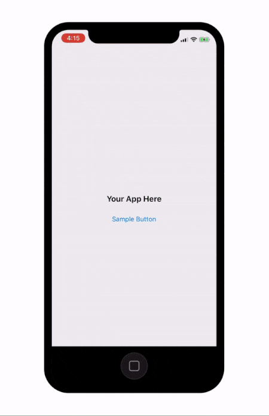
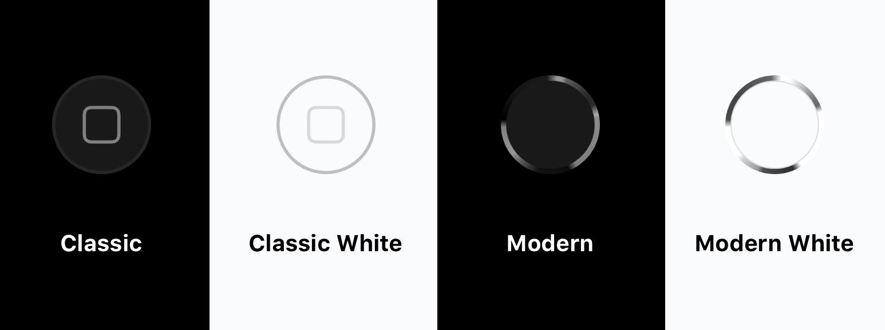

<p align="center">

</p>

[](https://travis-ci.org/nathangitter/HomeButton)
[](http://cocoapods.org/pods/HomeButton)
[](http://cocoapods.org/pods/HomeButton)
[](http://cocoapods.org/pods/HomeButton)


When Apple released the iPhone X, they removed iPhone's most iconic feature—the home button.

`HomeButton` is a CocoaPod that brings back the home button. Best part: **it actually works**.



## Usage

`HomeButton` can be added to your poject with zero lines of code. Yes, that's right—no code needed. Simply link the framework in your app, and the home button adds itself.

## Customization

`HomeButton` supports four styles: `classic`, `classicWhite`, `modern`, and `modernWhite`.

<p align="center">

</p>

The default style is `classic`. To change the style, add the following line:

    HomeButton.style = .modern
    
This can be placed anywhere in your app, but it probably makes the most sense in your AppDelegate's `application(_:didFinishLaunchingWithOptions:)` function.

## Installation via CocoaPods

`HomeButton` is available through [CocoaPods](http://cocoapods.org). To install
it, simply add the following line to your Podfile:

```ruby
pod 'HomeButton'
```

## Frequently Asked Questions

> Will this cause my app to be rejected from the App Store?

It explicity breaks guideline 5.2.1 due to usage of private API's and probably 5.2.5 as well for mimicking system UI. So honestly it depends on the mood of the reviewer.

> Is this a joke?

Because satire is sometimes lost over the internet—yes, this is a joke. It was created as a fun April Fool's project. However, we think it's actually a decent re-creation of the home button, and is valuable as a UI/UX experiment.

## Authors

[Nathan Gitter](https://twitter.com/nathangitter) and [Ian McDowell](https://twitter.com/ian_mcdowell)

## License

MIT. See the LICENSE file for more info.
